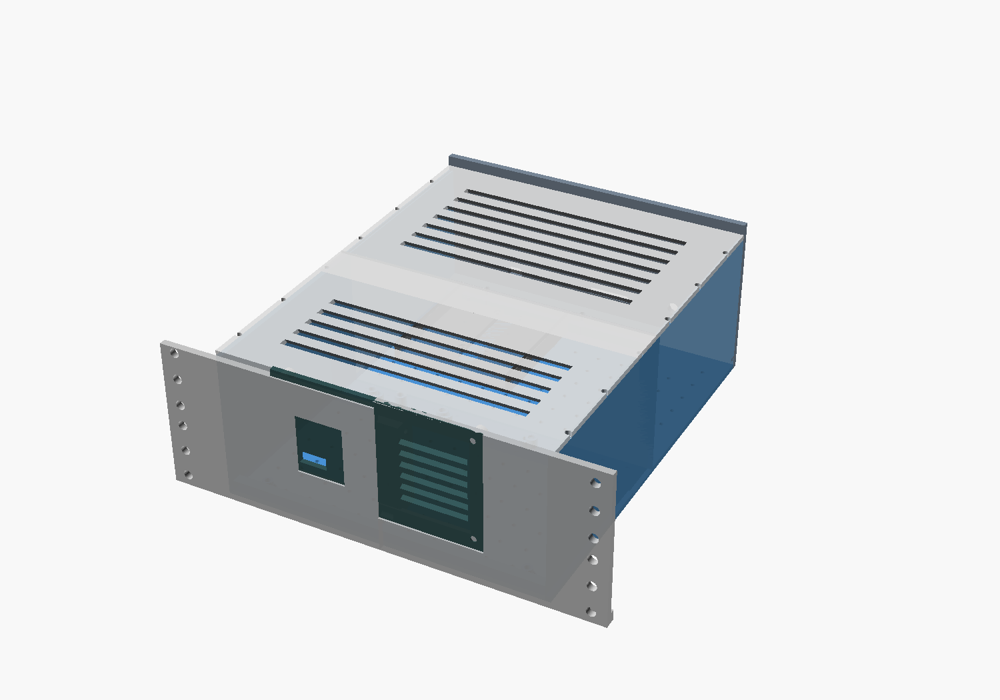
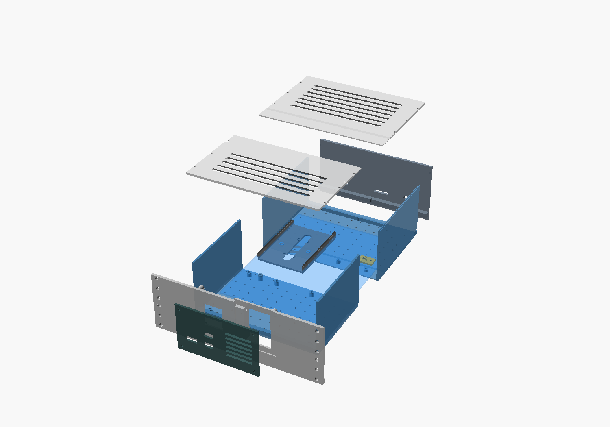
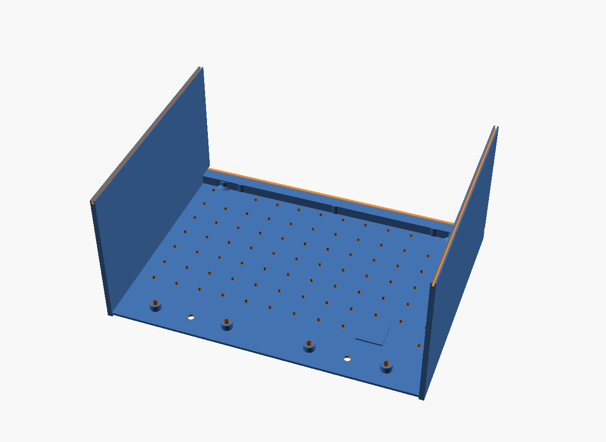

# dell-5558-rack-mount

A **3D-printable, highly-modular 2U case** that turns a salvaged **Dell Inspiron
15-5558 / 5559** laptop motherboard into a unit you can rack-mount in a **10-inch
"mini" server rack**. Modeled parametrically in **OpenSCAD**; every part prints
flat with no supports on a **Creality Ender 3 V3 SE** (220 × 220 mm bed) in PETG.



> ⚠️ **Work in progress.** The geometry is complete and renders/exports cleanly,
> but the board-specific dimensions in `parts/params.scad` are still **estimates
> tagged `// MEASURE`**. Caliper your board and update that one file before
> printing for real. See [Measuring your board](#measuring-your-board).

---

## Why

A repurposed laptop motherboard makes a tidy, low-power homelab node — but it has
no chassis, odd mounting holes, split I/O, and (on this board) a **missing M.2
retention standoff**. This project wraps it in a bolt-together enclosure that
mounts to a [NiH DIY 10" cage-nut rack](https://www.printables.com/model/1634385-project-diy-10-server-rack)
and solves each of those problems with an independently-printable, swappable
module.

| Target | Detail |
|---|---|
| **Board** | Dell Inspiron 15-5558 / 5559 (Compal LA-B843P / LA-D071P), ~235 × 170 mm |
| **Rack** | NiH "DIY 10-inch Server Rack" — EIA/ECA-310, **M5 cage nuts**, 236.525 mm rail spacing |
| **Height** | 2U (88.9 mm) — clears the SODIMMs + blower |
| **Printer** | Ender 3 V3 SE (220 × 220 × 250 mm); every part ≤ 190 mm/axis, flat, support-free |
| **Material** | PETG, 0.2 mm layer, 3–4 walls, 30–40 % infill |

---

## How it goes together

Everything bolts to **one shared 15 mm M3 self-tap pilot grid** on the baseplate,
so modules are independently printable and swappable.



| # | Part | Role |
|---|---|---|
| 1–2 | `baseplate_front` / `baseplate_rear` | Structural floor with integral side walls; split into two bed-friendly tiles joined by a bolted rabbet-lap + dowels. Carries the board M2.5 standoffs + the pilot grid. |
| 3–4 | `faceplate_left` / `faceplate_right` | The 254 mm rack faceplate, split at the centerline so each **M5 rack column stays whole on one tile**; joined by a dovetail + pin. |
| 5 | `io_subplate` | **Swappable** front I/O insert — `"default"` = HDMI + USB-A ×2 + louvered exhaust; `"rj45"` adds a front RJ45 for a future NGFF→1GbE NIC. |
| 6 | `m2_retainer` | Gusseted M2.5 post that **supplies the missing M.2 standoff**. |
| 7 | `rear_panel` | Rear I/O: USB-C power-in, SD reader, audio. |
| 8 | `ssd_cage` *(opt)* | 2.5" SATA tray, bolts to the grid beside the board. |
| 9 | `lid_front` / `lid_rear` *(opt)* | Vented 2U top in two tiles. |

The baseplate grid is **self-tapping pilot holes**, not a carpet of inserts —
you drive an M3 straight into the PETG only where a module lands:



Full mechanical spec, joinery, BOM, and print-plate layout: **[`CASE_DESIGN.md`](CASE_DESIGN.md)**.

---

## Build it

Requires [OpenSCAD](https://openscad.org/) (2021.01+).

```bash
# View the whole assembly
openscad main.scad

# Export the full assembly to STL
openscad -o assembly.stl main.scad

# Export a single printable part
openscad -o baseplate_front.stl parts/baseplate_front.scad
```

`main.scad` knobs: `EXPLODE` (mm, for an exploded view), `SHOW_SSD`, `SHOW_LID`,
`SHOW_BOARD`. The optional `io_subplate` variant is `IO_VARIANT` in
`parts/params.scad`.

### Layout

```
main.scad              top-level assembly (unions all parts, no transforms)
parts/params.scad      the frozen contract — ALL dimensions live here
parts/*.scad           one printable module per file
lib/joinery.scad       reusable parametric joints (dovetail, lap, grid, …)
docs/img/              rendered previews
reference-images/      photos of the donor board
```

---

## Measuring your board

The model renders today on sane defaults, but anything tagged `// MEASURE` in
`parts/params.scad` should be calipered and corrected before a real print:

1. PCB length × width and the 5 mounting-hole positions (4 corners + center)
2. M.2 connector position + retainer distance + your card length (2242/2260/2280)
3. Blower exhaust outlet size + position
4. Front port positions (HDMI, USB-A ×2) and rear (USB-C, SD, audio)
5. SODIMM seated height (confirms 2U)

Edit **only** `parts/params.scad` — every part derives from it.

The donor board this was designed around:


---

## License

[MIT](LICENSE) © 2026 Benny Gil. The Dell board and the NiH rack are referenced
for fit only and are the property of their respective owners.
