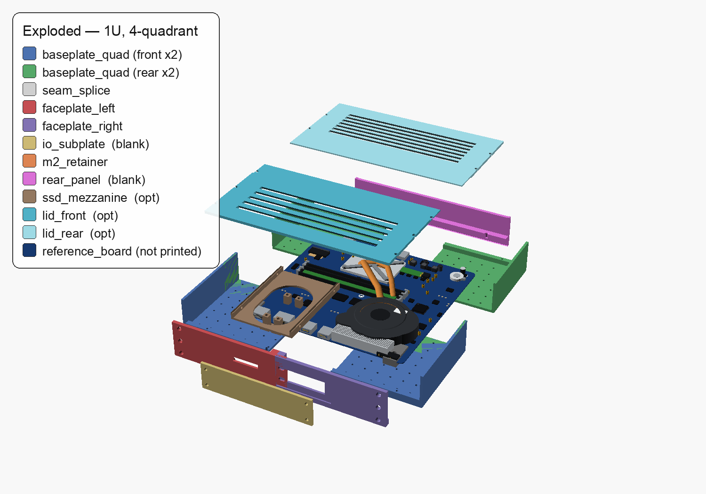
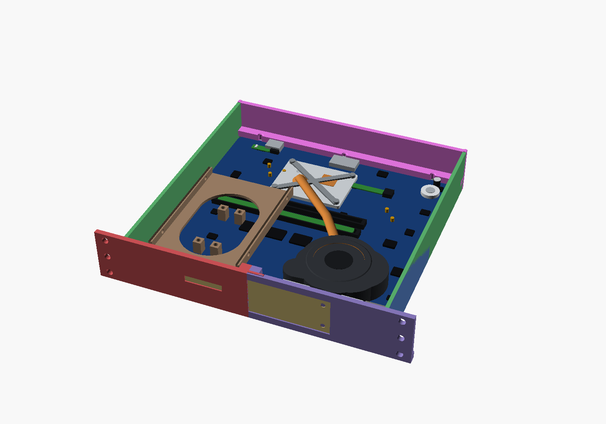
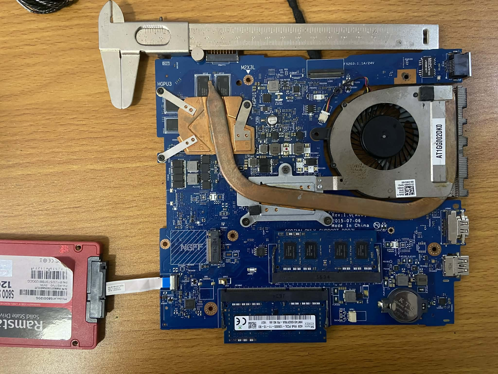
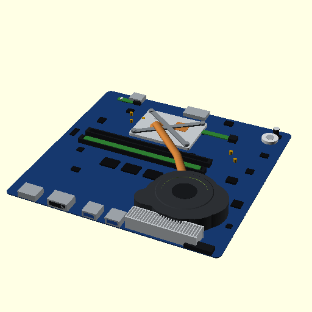

# dell-5558-rack-mount

A **3D-printable, highly-modular 1U case** that turns a salvaged **Dell Inspiron
15-5558 / 5559** laptop motherboard into a unit you can rack-mount in a **10-inch
"mini" server rack**. Modeled parametrically in **OpenSCAD**; every part prints
flat with no supports on a low-accuracy **Creality Ender 3 V3 SE** (220 × 220 mm
bed) in PETG.


> ⚠️ **Work in progress.** The geometry is complete and renders/exports cleanly,
> but the board-specific dimensions in `parts/params.scad` are still **estimates
> tagged `// MEASURE`**. Caliper your board and update that one file before
> printing for real. See [Measuring your board](#measuring-your-board).

---

## Design language — "loose-fit, bolt-tight"

This is a **Round-2 redesign** for a low-accuracy printer. The governing rule is
**LOOSE-FIT, BOLT-TIGHT**: nothing relies on a dimensionally accurate print to
mate. Every seam carries a `FIT_CLEARANCE` (0.5 mm) gap that absorbs print slop,
and **bolts pull the seams flush** rather than press-fit tolerances. Concretely:

- The baseplate is **four bed-friendly quadrants** bolted together by flat
  **seam-splice** bars across each seam — no tight interlocks to fight.
- The board is **not** held by fixed, dimensionally-critical standoffs. Instead
  it sits on **grid-placed `m25_grid_insert` standoffs** you drop onto the pilot
  grid wherever the board's holes land, and is trapped at the edges by
  **`board_edge_clip`** fingers. Slop in the print is taken up by the grid, not
  by a hole you have to hit exactly.
- Front `io_subplate` and `rear_panel` ship **blank** — you drill the actual
  port cutouts to your board after a test fit, so a misjudged dimension is a
  drill bit away, not a reprint.

---

## Why

A repurposed laptop motherboard makes a tidy, low-power homelab node — but it has
no chassis, odd mounting holes, split I/O, and (on this board) a **missing M.2
retention standoff**. This project wraps it in a bolt-together enclosure that
mounts to a [NiH DIY 10" cage-nut rack](https://www.printables.com/model/1634385-project-diy-10-server-rack)
and solves each of those problems with an independently-printable, swappable
module — none of which needs a precise print to work.

| Target | Detail |
|---|---|
| **Board** | Dell Inspiron 15-5558 / 5559 (Compal LA-B843P / LA-D071P), near-square ~203 × 197 mm |
| **Rack** | NiH "DIY 10-inch Server Rack" — EIA/ECA-310, **M5 cage nuts**, three 1U face holes per column |
| **Height** | **1U (44.45 mm)** — low-profile; board lies flat with its SODIMMs/blower under the lid |
| **Printer** | Ender 3 V3 SE (220 × 220 × 250 mm), low accuracy; every part ≤ ~190 mm/axis, flat, support-free |
| **Material** | PETG, 0.2 mm layer, 3–4 walls, 30–40 % infill |

---

## How it goes together

Everything bolts to **one shared 15 mm M3 self-tap pilot grid** on the
quadrant baseplate, so modules are independently printable, swappable, and
forgiving of print error.



> The labeled legend image above is from an earlier revision and is **stale** —
> treat the unlabeled `assembly_iso` / `assembly_exploded` renders as current.

| # | Part | Role |
|---|---|---|
| 1–4 | `baseplate` → `baseplate_quad(qx,qy)` ×4 | Structural floor split into **four bed-friendly quadrants** with integral side walls; tied together by flat **`seam_splice`** bars bolted across the X and Y seams. Carries the 15 mm M3 self-tap pilot grid. |
| – | `seam_splice()` | Flat bridging bar that bolts across a quadrant seam into the grid (the "bolt-tight" half of the seam). |
| 5–6 | `faceplate_left` / `faceplate_right` | The 254 mm rack faceplate, split at the centerline (X=106) so each **M5 rack column stays whole on one tile**. |
| 7 | `io_subplate` | **Blank** swappable front insert with the 130 × 32 I/O window — you drill HDMI / USB-A / exhaust to your board after a fit check. |
| 8 | `m2_retainer` | Gusseted M2.5 post that **supplies the missing M.2 standoff**. |
| 9 | `rear_panel` | **Blank** rear panel — drill USB-C power-in / SD / audio to your board later. |
| 10 | `ssd_mezzanine` *(opt)* | 2.5" SATA drive carrier on stilts **above** the board, bolted to the grid. |
| 11 | `lid` → `lid_front()` / `lid_rear()` *(opt)* | Vented 1U top in two tiles. |
| – | `m25_grid_insert()` | Grid-dropped M2.5 board standoff (placed where the board holes land, not fixed). |
| – | `board_edge_clip()` | Finger that traps the board edge — board retention without a critical hole. |

With the lid off, the board drops onto grid-placed M2.5 standoffs, is trapped by
edge clips, and the I/O lines up behind the blank front subplate:



The baseplate grid is **self-tapping pilot holes**, not a carpet of inserts —
you drive an M3 straight into the PETG only where a module (or standoff) lands:


Full mechanical spec, joinery, BOM, and print-plate layout: **[`CASE_DESIGN.md`](CASE_DESIGN.md)**.

---

## Build it

Requires [OpenSCAD](https://openscad.org/) (2021.01+).

```bash
# View the whole assembly
openscad main.scad

# Export the full assembly to STL
openscad -o assembly.stl main.scad

# Export a single printable part
openscad -o faceplate_left.stl parts/faceplate_left.scad

# Export one baseplate quadrant
echo 'use <parts/baseplate.scad> baseplate_quad(0,0);' > q.scad
openscad -o quad.stl q.scad
```

`main.scad` knobs: `EXPLODE` (mm, for an exploded view), `SHOW_SSD`, `SHOW_LID`,
`SHOW_BOARD`, `SHOW_MOUNTS` (the illustrative grid standoffs + edge clips).

### Layout

```
main.scad                 top-level assembly (unions all parts, no transforms)
parts/params.scad         the frozen contract — ALL dimensions live here
parts/*.scad              one printable module per file
parts/reference_board.scad  visual-only board model (never printed)
lib/joinery.scad          reusable parametric joints (lap, grid, inserts, clips, …)
docs/img/                 rendered previews
reference-images/         photos of the donor board
```

---

## Measuring your board

The model renders today on sane defaults, but anything tagged `// MEASURE` in
`parts/params.scad` should be calipered and corrected before a real print. Note
that the loose-fit design tolerates small errors — and the **blank** io_subplate
and rear_panel are **drilled to fit after assembly**, so port positions are the
least critical of all:

1. PCB length × width (near-square ~203 × 197 mm) and the mounting-hole positions
2. M.2 connector position + retainer distance + your card length (2242/2260/2280)
3. Blower exhaust outlet size + position (drilled into the io_subplate)
4. Front port positions (HDMI, USB-A ×2) and rear (USB-C, SD, audio) — drilled later
5. SODIMM + blower seated height (confirms the 1U lid clears)

Edit **only** `parts/params.scad` — every part derives from it.

The donor board this was designed around — and the recognizable OpenSCAD
reference model (`parts/reference_board.scad`, visual-only) built from it that
appears in the renders above:

| Donor board (photo) | Reference model |
|---|---|
|  |  |

---

## License

[MIT](LICENSE) © 2026 Benny Gil. The Dell board and the NiH rack are referenced
for fit only and are the property of their respective owners.
